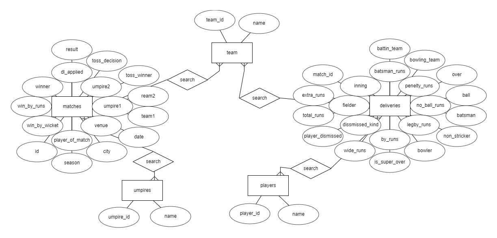

# IPL Project
[solution](https://github.com/mountblue/mbc-js-16-1-ipl-sql-Lokesh9756)
## Table of Contents
1. [General Info](#general-info)
2. [Technologies](#technologies)
3. [Installation](#installation)
4. [Collaboration](#collaboration)
### General Info
***
In thhis project two .csv file given we have to create postgres database and insert  normalize data into database by creating seprate table for redundance data.Output of all functions stores in seprate json files in output folder.
#### Following are the operation to perform :
1. Print number of matches played per year for all the years in IPL using sql query.
2. Print number of matches won per team per year in IPL using sql query.
3. Print extra runs conceded per team in the year 2016 using sql query.
4. Print top 10 economical bowlers in the year 2015 using sql query.
#### ERD
ER- Diagram show the relation between tables here we have have a screenshoot to show the relation between tables whic is used in this project database.

 
## Technologies
***
A list of technologies used within the project:
* [JavaScript](https://www.javatpoint.com/javascript-tutorial) 
* [Linux](https://www.javatpoint.com/linux-tutorial)
* [Git](https://example.com)
* [Postgres](https://www.postgresql.org/)
## Installation
***
A little intro about the installation. 
```
$ git clone https://github.com/mountblue/mbc-js-16-1-ipl-sql-Lokesh9756
$ cd ~/Desktop/mountblueprojects/mbc-js-16-1-ipl-sql-Lokesh9756
$ npm install
$ npm start
$ npm init
$ sudo sh -c 'echo "deb http://apt.postgresql.org/pub/repos/apt $(lsb_release -cs)-pgdg main" > /etc/apt/sources.list.d/pgdg.list'
$ wget --quiet -O - https://www.postgresql.org/media/keys/ACCC4CF8.asc | sudo apt-key add -
$ sudo apt-get update
$ sudo apt-get -y install postgresql
$ npm install dotenv
```
## Collaboration
***
Instruction how to collaborate with project.
> * Here we have a index.js  file. 
> * Index.js file have all queries to print output.
> * We have six severate file to connection and insert data in database.
> * To print output of all four question we have to run index.js file.


